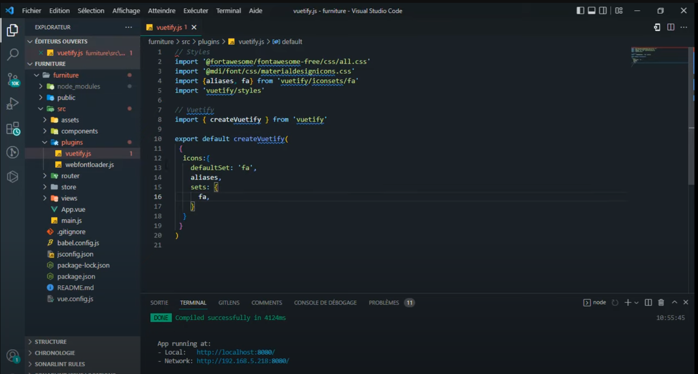

# CH07.Button & Icons

  

## 1\. Font Icons 사용하기

##   

### 1)  Material Icons 사용

  

```
<template>
  <v-icon icon="home" />
</template>
```

  

  

### 2)  Font Awesome 사용

  

- Vue 프로젝트 폴더 설치

```
vue create todo
```

  

- Vuetify 설치

```
vue add vuetify
- 옵션 :  Vuetify 3 - vue3 (preview) 버전으로 설치
```

  

  

- 폰트어썸 패키지 설치하기

```
npm install @fortawesome/fontawesome-free -D
```

  

- plugins/vuetify.js  -  환경설정

```
// Styles
import '@fortawesome/fontawesome-free/css/all.css'
import '@mdi/font/css/materialdesignicons.css'
import { fa } from 'vuetify/iconsets/fa'
import { mdi } from 'vuetify/iconsets/mdi'
import 'vuetify/styles'

// Vuetify
import { createVuetify } from 'vuetify'
import * as components from 'vuetify/components'
import * as directives from 'vuetify/directives'

export default createVuetify(
  {
    icons: {
      defaultSet: 'fa',
      sets: {
        fa,
        mdi
      }
    },
    components,
    directives,
  }
)
```

  

  

- 샘플 코드

```
<template>
  <v-app-bar app dark flat>
    <v-btn>
      <v-icon>fas fa-bars</v-icon>
    </v-btn>
  </v-app-bar>
</template>
```

  

  

  

  

  

  

  

## 2\. 버튼 사용하기

  

  

  

  

  

  

* * *

  

  

## 1\. 예시 샘플(1)

  

- HTML

```


```

  

- CSS

```


```